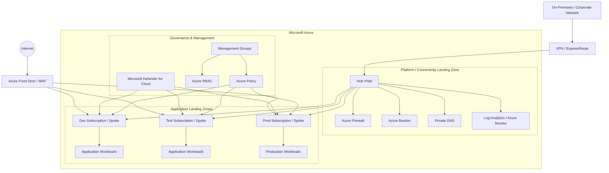
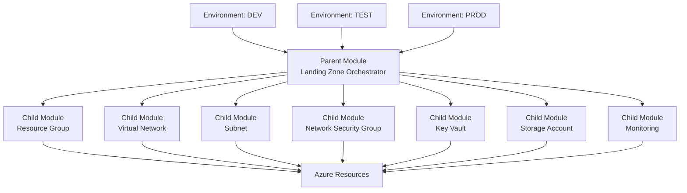
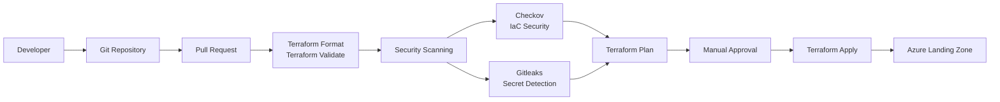
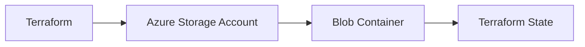
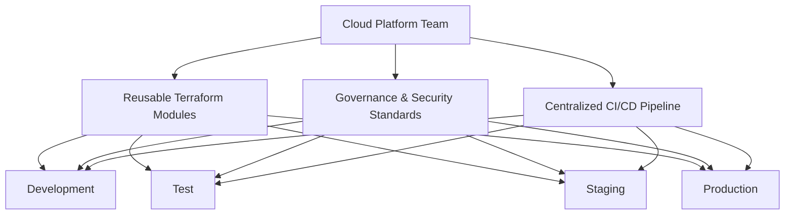

# terraform-multicloud-labs
This is for Monolithic reusable code of terraform to build Landing Zone.


# 🚀 Azure Landing Zone using Terraform Parent–Child Modules

> **Build once. Reuse everywhere. Deploy consistently. Govern centrally.**

## 📌 Project Overview

This project demonstrates the implementation of an **enterprise-ready Azure Landing Zone using Terraform Infrastructure as Code (IaC)**.

The solution follows a **Parent–Child Terraform Module architecture** to create reusable, scalable, and standardized Azure infrastructure.

The architecture is designed to support:

* Enterprise Cloud Adoption
* Centralized Governance
* Secure Networking
* Identity and Access Management
* Infrastructure Automation
* DevSecOps
* Multi-Environment Deployments
* Reusable Infrastructure Modules

The solution can be extended across **Development, Test, Staging, and Production** environments while maintaining consistent infrastructure standards.

---

# 🏗️ 1. Azure Landing Zone Architecture

The following high-level architecture represents the Landing Zone design, where centralized platform services provide governance, security, networking, and monitoring for application workloads.



### Architecture Highlights

* **Management Groups** provide a hierarchical governance structure.
* **Azure Policy** enforces organizational compliance and standards.
* **Azure RBAC** implements least-privilege access.
* **Hub VNet** provides centralized connectivity services.
* **Azure Firewall** provides centralized network security.
* **Azure Bastion** enables secure VM access without exposing public IPs.
* **Private DNS** supports private connectivity and name resolution.
* **Log Analytics and Azure Monitor** provide centralized monitoring.
* **Spoke VNets** host application workloads.
* **Azure Front Door / WAF** provides global application entry and web protection.

> The architecture can be extended with Azure Virtual WAN, Private Endpoints, ExpressRoute, VPN Gateway, Sentinel, Defender for Cloud, and other enterprise platform services based on workload requirements.

---

# 🧩 2. Terraform Parent–Child Module Architecture

This project uses a layered Terraform architecture.

The **Child Modules** are responsible for creating individual Azure resources, while the **Parent Modules** orchestrate multiple child modules to build larger infrastructure components.



### Module Responsibility

| Layer                         | Responsibility                                    |
| ----------------------------- | ------------------------------------------------- |
| **Environment / Root Module** | Provides environment-specific configuration       |
| **Parent Module**             | Orchestrates multiple child modules               |
| **Child Module**              | Creates a specific Azure resource                 |
| **Variables**                 | Provides configurable inputs                      |
| **Outputs**                   | Exposes resource information to dependent modules |
| **Terraform State**           | Tracks infrastructure lifecycle                   |

### Example Module Flow

```text
env/dev
   │
   ▼
Parent Module
   │
   ├── Resource Group Module
   │
   ├── VNet Module
   │
   ├── Subnet Module
   │
   ├── NSG Module
   │
   ├── Key Vault Module
   │
   └── Storage Account Module
   │
   ▼
Azure Landing Zone
```

This approach allows the same child modules to be reused across multiple environments.

```text
                 Reusable Child Modules
                         │
          ┌──────────────┼──────────────┐
          │              │              │
          ▼              ▼              ▼
        DEV            TEST           PROD
          │              │              │
          ▼              ▼              ▼
    Same Standards  Same Standards  Same Standards
```

---

# 🔄 3. CI/CD + DevSecOps Pipeline Flow

Infrastructure deployment is automated through a CI/CD pipeline.

Security and compliance checks are integrated into the pipeline before infrastructure is deployed to Azure.



### Pipeline Stages

```text
1. Developer Commit
        ↓
2. Pull Request
        ↓
3. Terraform Format
        ↓
4. Terraform Validate
        ↓
5. Checkov Security Scan
        ↓
6. Gitleaks Secret Scan
        ↓
7. Terraform Plan
        ↓
8. Manual Approval
        ↓
9. Terraform Apply
        ↓
10. Azure Landing Zone
```

### DevSecOps Controls

The pipeline integrates security into the Infrastructure as Code lifecycle.

**Checkov** is used to identify Terraform security and compliance misconfigurations.

```bash
checkov -d .
```

**Gitleaks** is used to detect accidentally committed secrets.

```bash
gitleaks detect --source .
```

> Secrets and credentials should never be hardcoded in Terraform source code. Sensitive configuration should be managed using secure mechanisms such as Azure Key Vault, Managed Identity, or federated workload identity.

---

# 🗄️ 4. Terraform State Management

For enterprise environments, Terraform state should be stored remotely.



The remote backend provides:

* Centralized state management
* Team collaboration
* State locking
* Controlled access
* Environment isolation
* Reduced risk of state corruption

Example environment separation:

```text
Azure Storage Account
│
├── dev.tfstate
├── test.tfstate
└── prod.tfstate
```

---

# 🎯 5. Enterprise Deployment Model

The complete solution follows this enterprise deployment pattern:



This model enables organizations to establish a **standardized cloud platform** where application teams can consume pre-approved infrastructure patterns while the Cloud Platform team maintains centralized governance and security.


# 🏆 Key Benefits

### ♻️ Reusability

Child modules can be reused across multiple environments and projects.

### 📈 Scalability

New resources and platform capabilities can be added without redesigning the entire Terraform codebase.

### 🛡️ Governance

Centralized modules and policies help enforce organizational standards.

### 🔐 Security

Security controls are integrated into both infrastructure architecture and CI/CD pipelines.

### 🔄 Consistency

The same infrastructure patterns can be deployed consistently across Development, Test, Staging, and Production.

### 🤖 Automation

Infrastructure provisioning is automated through Terraform and CI/CD pipelines.

### 📦 Standardization

Reusable modules help eliminate manual configuration and reduce deployment inconsistencies.


# 🚀 Key Architecture Principles

* Infrastructure as Code
* Modular Terraform Architecture
* Parent–Child Module Design
* Reusability
* Scalability
* Security by Design
* Policy as Code
* Least Privilege
* Automated CI/CD
* DevSecOps
* Remote State Management
* Environment Isolation
* Centralized Governance


# 🔮 Future Enhancements

The Landing Zone architecture can be further enhanced with:

* Azure Management Groups
* Azure Policy at Management Group Scope
* Subscription Vending
* RBAC Automation
* Hub-Spoke Networking
* Azure Virtual WAN
* Private Endpoints
* Private DNS Zones
* Azure Firewall
* Azure Bastion
* Microsoft Defender for Cloud
* Microsoft Sentinel
* Centralized Logging
* Azure Monitor
* Automated Subscription Provisioning
* OIDC / Workload Identity Federation
* Drift Detection


# 📚 Learning Objectives

This project demonstrates practical implementation of:

* Azure Landing Zone Architecture
* Terraform Infrastructure as Code
* Parent–Child Module Architecture
* Reusable Terraform Modules
* Azure Networking
* Azure Security and Governance
* Terraform Remote State
* CI/CD Automation
* DevSecOps
* Infrastructure Security Scanning
* Enterprise Cloud Architecture


# 👨‍💻 Author

**Rajeev Ranjan**

Azure Cloud | DevOps | DevSecOps | Terraform | Cloud Architecture


## ⭐ Conclusion

This project demonstrates how Terraform can be used to build a **modular, reusable, scalable, secure, and governed Azure Landing Zone**.

By separating infrastructure into **Parent and Child Terraform Modules**, the solution enables organizations to standardize cloud infrastructure while allowing teams to provision resources consistently through automation.

The architecture follows an **enterprise cloud platform approach**, where **security, governance, scalability, reusability, and automation** are treated as first-class principles.

> **Build once. Reuse everywhere. Deploy consistently. Govern centrally.**
