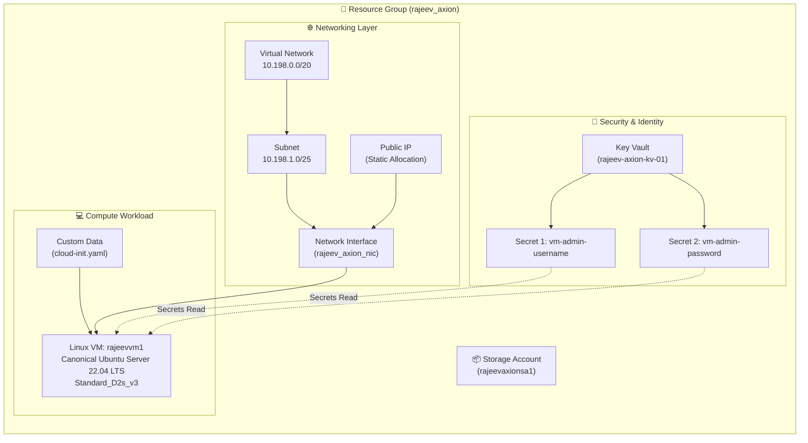

# 🚀 terraform-multicloud-labs


<div align="center">


<br/>

> ⚡ **Enterprise-Ready Azure Infrastructure as Code (IaC)** powered by **Terraform Parent–Child Architecture** & **GitHub Actions OIDC CI/CD Pipeline**.

<br/>


</div>

---

## 📌 Project Overview 🎯

This repository (`terraform-multicloud-labs`) implements an enterprise-standard, modular **Azure Landing Zone** using **Terraform (HCL)** and **GitHub Actions keyless OIDC authentication**.

The architecture uses a **Parent–Child Module design** where individual child modules encapsulate Azure resources (Resource Group, VNet, Subnets, Key Vaults, Public IPs, Network Interfaces, Storage Accounts, and Linux Virtual Machines), and the root environment (`env/dev`) orchestrates these modules cleanly.

---

## 📂 Repository Structure 📁

```text
📦 terraform-multicloud-labs
 ┣ 📂 .github
 ┃ ┗ 📂 workflows
 ┃ ┃ ┣ 📜 azure-oidc-test.yml       # 🧪 Azure OIDC Connection Test Workflow
 ┃ ┃ ┗ 📜 terraform-dev.yml         # 🚀 Main Terraform CI/CD Deployment Pipeline
 ┣ 📂 child_module
 ┃ ┣ 📂 azurerm_key_vault           # 🔑 Key Vault Child Module
 ┃ ┣ 📂 azurerm_key_vault_secret    # 🔐 Key Vault Secrets Child Module
 ┃ ┣ 📂 azurerm_nic                 # 🔌 Network Interface (NIC) Child Module
 ┃ ┣ 📂 azurerm_pip                 # 🌐 Public IP Address Child Module
 ┃ ┣ 📂 azurerm_rg                  # 📁 Resource Group Child Module
 ┃ ┣ 📂 azurerm_storage_account     # 📦 Storage Account Child Module
 ┃ ┣ 📂 azurerm_subnet              # 🕸️ Subnet Child Module
 ┃ ┣ 📂 azurerm_virtual_machine     # 💻 Linux Virtual Machine Child Module
 ┃ ┗ 📂 azurerm_vnet                # 🌐 Virtual Network (VNet) Child Module
 ┗ 📂 env
   ┗ 📂 dev                         # 🛠️ Development Environment Root Module
     ┣ 📜 .terraform.lock.hcl       # 🔒 Provider Dependency Lock File
     ┣ 📜 cloud-init.yaml           # 📜 VM Provisioning Script (Custom Data)
     ┣ 📜 main.tf                   # 🧩 Parent Module Orchestration
     ┣ 📜 provider.tf               # ⚙️ AzureRM Provider & Remote State Backend
     ┣ 📜 terraform.tfvars          # 📝 Dev Variable Input Values
     ┗ 📜 variable.tf               # 📋 Variable Input Definitions
```

---

## 🏗️ Managed Azure Resources Detailed Breakdown 🛠️

Below is a detailed breakdown of all Azure infrastructure resources provisioned and managed by this repository:



### 📋 Detailed Resource Specifications

| Resource Type | Resource Name | Purpose & Configuration |
| :--- | :--- | :--- |
| 📁 **Azure Resource Group** | `rajeev_axion` | Central logical container holding all DEV environment deployment components in region `westus`. |
| 📦 **Storage Account** | `rajeevaxionsa1` | General-purpose Azure Storage Account configured with `Standard_LRS` redundancy. |
| 🌐 **Virtual Network** | `rajeev_axion_vnet` | Isolated network environment defined with CIDR block `10.198.0.0/20`. |
| 🕸️ **Subnet** | `rajeev_axion_subnet` | Application subnet within VNet with address space `10.198.1.0/25`. |
| 📡 **Public IP** | `rajeev_axion_pip` | Dedicated Public IP address with `Static` IP allocation for VM external access. |
| 🔌 **Network Interface** | `rajeev_axion_nic` | NIC mapping the Subnet and Static Public IP to the Linux Virtual Machine. |
| 🔑 **Azure Key Vault** | `rajeev-axion-kv-01` | Secure Key Vault with RBAC/Access Policy supporting `Get`, `List`, `Set`, `Delete`, and `Purge` permissions. |
| 🔐 **Key Vault Secrets** | `vm-admin-username`<br/>`vm-admin-password` | Stores VM administrator login credentials securely inside Key Vault without hardcoding passwords in Terraform. |
| 💻 **Linux Virtual Machine** | `rajeevvm1` | `Standard_D2s_v3` Ubuntu 22.04 LTS server. Reads credentials directly from Key Vault and runs custom setup scripts from `cloud-init.yaml`. |

---

## 🧩 1. Reusable Child Modules 🧱

Each child module in `child_module/` is built dynamically using `for_each` meta-arguments to allow scalable multi-resource deployment:

| Module | Icon | Functionality & Key Features |
| :--- | :---: | :--- |
| **`azurerm_rg`** | 📁 | Dynamically provisions Azure Resource Groups (`var.axion`). |
| **`azurerm_storage_account`** | 📦 | Provisions Azure Storage Accounts (`Standard_LRS`, Blob, etc.). |
| **`azurerm_vnet`** | 🌐 | Deploys Virtual Networks with customizable CIDR spaces. |
| **`azurerm_subnet`** | 🕸️ | Provisions Subnets mapped to target Virtual Networks. |
| **`azurerm_pip`** | 📡 | Allocates Static / Dynamic Public IP addresses. |
| **`azurerm_nic`** | 🔌 | Creates Network Interfaces, resolving Subnet & Public IP IDs dynamically via `data` blocks. |
| **`azurerm_key_vault`** | 🔑 | Deploys Azure Key Vaults with tenant access policies (`Get`, `List`, `Set`, `Delete`). |
| **`azurerm_key_vault_secret`** | 🔐 | Manages and injects sensitive admin credentials into Key Vaults. |
| **`azurerm_virtual_machine`** | 💻 | Provisions Linux VMs with Key Vault dynamic secret resolution & `cloud-init.yaml` custom data. |

---

## ⚙️ 2. Environment Configuration (`env/dev`) 🛠️

The `env/dev` directory represents the **Development Environment** orchestrator:

### 🔒 Remote Azure Backend (`provider.tf`)
State is securely persisted in Azure Blob Storage with optimistic state locking:

```hcl
terraform {
  required_version = ">= 1.5.0"

  required_providers {
    azurerm = {
      source  = "hashicorp/azurerm"
      version = ">= 4.0, < 6.0"
    }
  }

  backend "azurerm" {
    resource_group_name  = "rg-rajeev"
    storage_account_name = "rajeevaxionsa2"
    container_name       = "tfstate"
    key                  = "dev.terraform.tfstate"
  }
}

provider "azurerm" {
  features {}
}
```

### 🧩 Module Orchestration (`main.tf`)
Modules are composed cleanly using natural dependency graph resolution:

```hcl
module "axion" {
  source = "../../child_module/azurerm_rg"
  axion  = var.axion
}

module "axion_storage_account" {
  depends_on            = [module.axion]
  source                = "../../child_module/azurerm_storage_account"
  axion_storage_account = var.axion_storage_account
}

# Subnet, PIP, NIC, Key Vault, Secrets, and VM modules...
```

---

## 🔄 3. CI/CD & DevSecOps Pipeline 🤖

Infrastructure deployment is fully automated through **GitHub Actions** with keyless **OpenID Connect (OIDC)** authentication (`azure/login@v2`).

```mermaid
flowchart LR
    Push["🚀 Push / PR to main"] --> Checkout["📥 Actions Checkout"]
    Checkout --> OIDC["🔑 Azure Login (OIDC)"]
    OIDC --> Verify["🔍 az account show"]
    Verify --> SetupTF["⚙️ Setup Terraform"]
    SetupTF --> Format["🎨 terraform fmt"]
    Format --> Init["🔄 terraform init"]
    Init --> Validate["✅ terraform validate"]
    Validate --> Plan["📊 terraform plan"]
    Plan --> Apply["🚀 terraform apply (on main)"]
```



### 🔒 Azure OIDC Security Controls

```yaml
permissions:
  id-token: write
  contents: read

env:
  ARM_USE_OIDC: true
  ARM_CLIENT_ID: ${{ secrets.AZURE_CLIENT_ID }}
  ARM_TENANT_ID: ${{ secrets.AZURE_TENANT_ID }}
  ARM_SUBSCRIPTION_ID: ${{ secrets.AZURE_SUBSCRIPTION_ID }}
```

---

## 💻 Local Execution Guide 🛠️

### 📋 Prerequisites
* 🛠️ **[Terraform CLI](https://developer.hashicorp.com/terraform/downloads)** (v1.5.0+)
* ☁️ **[Azure CLI](https://docs.microsoft.com/en-us/cli/azure/install-azure-cli)** (`az login`)

### ⚡ Quickstart Commands
```bash
# 1️⃣ Navigate to DEV environment
cd env/dev

# 2️⃣ Initialize Terraform & Azure Backend
terraform init

# 3️⃣ Validate configuration syntax
terraform validate

# 4️⃣ Generate execution plan
terraform plan -var-file="terraform.tfvars"

# 5️⃣ Deploy infrastructure
terraform apply -var-file="terraform.tfvars" -auto-approve
```

---

## 👨‍💻 Author 🌟

<div align="center">

### **Rajeev Ranjan**  
*Azure Cloud Architect | DevOps Engineer | DevSecOps & Terraform Specialist*

[](https://linkedin.com)
[](https://github.com/Rajeevsingh143)

</div>

---

<div align="center">
⭐ <i>If you found this project helpful, please consider giving it a star!</i> ⭐
</div>
